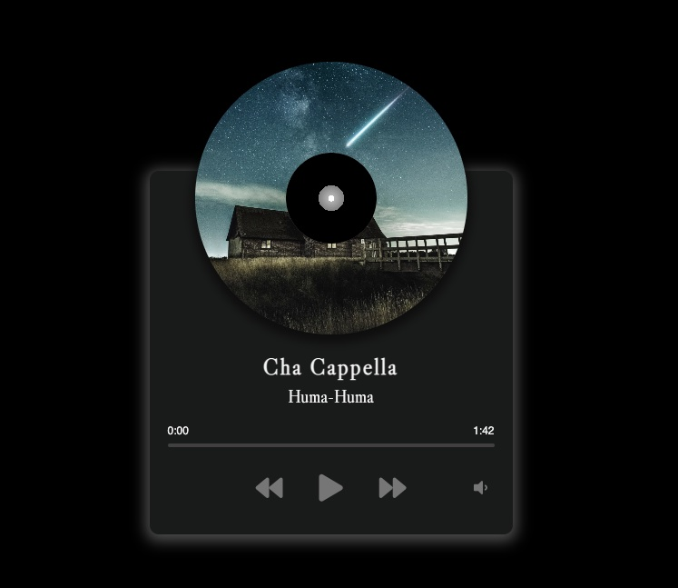

# Music-Player
music player with custom controls

- music player with custom controls and animation
- responsive design
---
## What I Learn
- how to customize default styled element
- search and apply events and methods of audio element
- use `this` in inline event-handler to access information of DOM element (clientWidth , offset etc ...)
